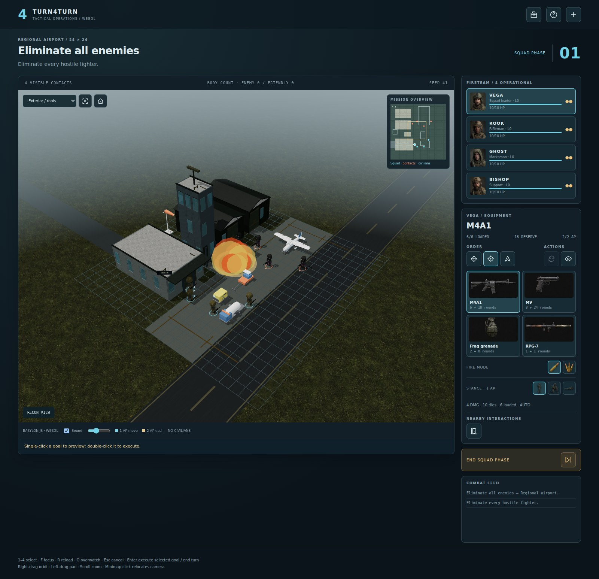
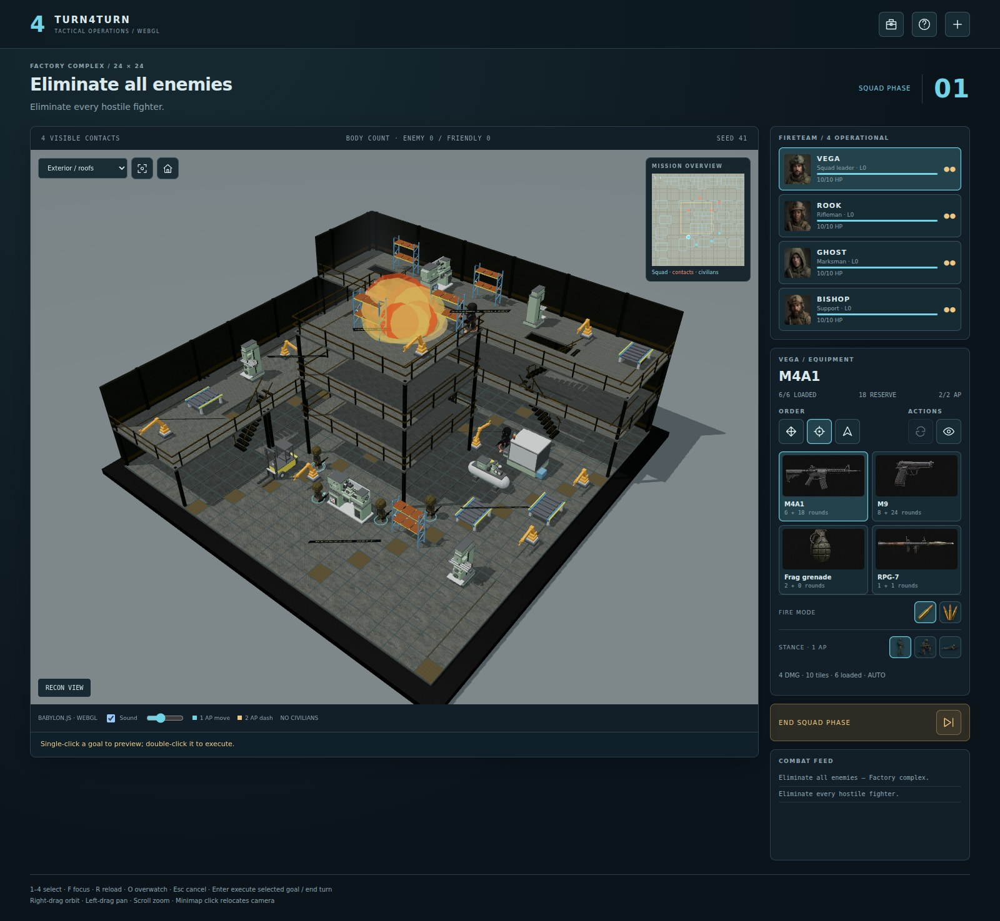
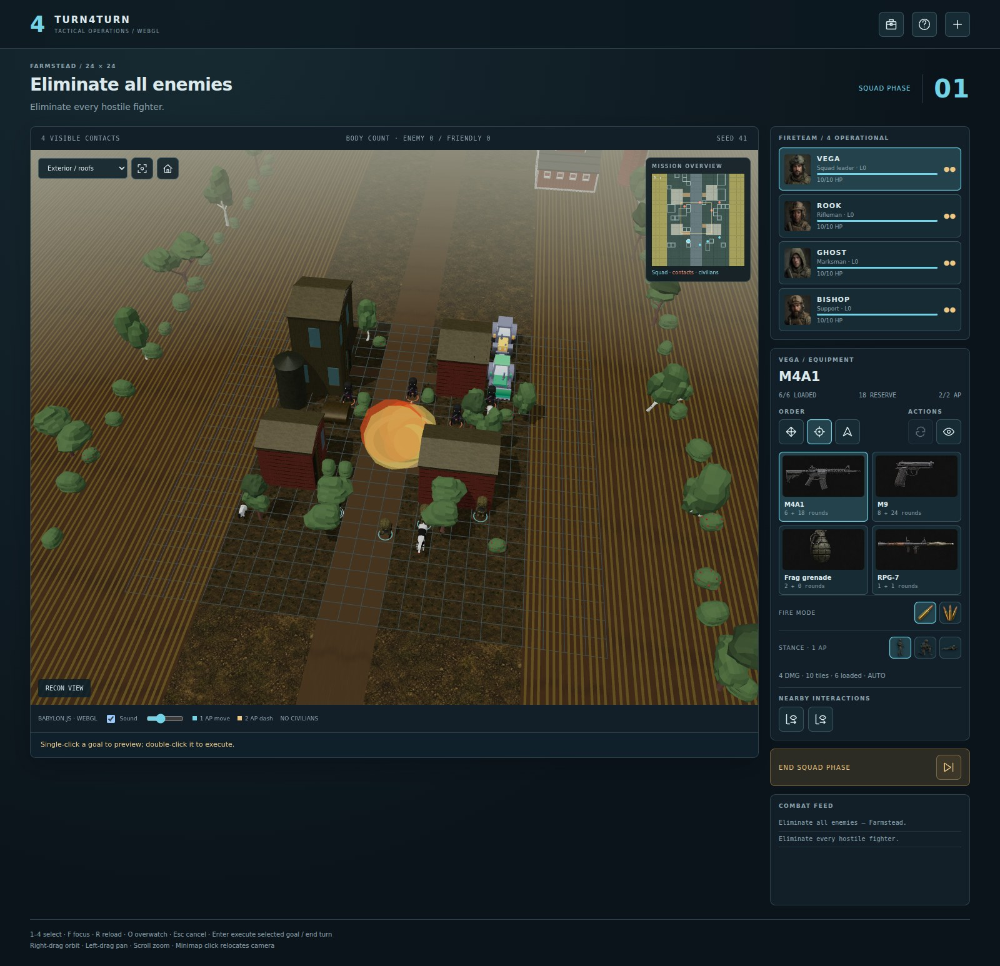

# Turn4Turn

Command a four-person fireteam in a turn-based tactical game for your browser.
Move through cover, clear buildings floor by floor, and make every action point count.

> A vibe coding project by [Janis Keuper](https://github.com/keuperj), built with GPT-6 Astra.

*Fight across airport aprons, hangars and the control tower.*

## Play your way

- Take on a **ten-mission campaign** or create a custom mission: eliminate
  hostiles, rescue civilians, capture a flag, or defend your position.
- Choose from **seven battlefields**: city blocks, factories, train stations,
  airports, suburban streets, woodlands and farms—with day or night missions.
- Equip your squad with rifles, sniper weapons, rockets, grenades, smoke and
  medical supplies. Use overwatch, high ground and flanking to gain the advantage.
- Blow open a route through destructible scenery, but watch your blast radius:
  friendlies and civilians can be caught in the explosion.

*Clear the factory's crowded work floors and connected upper levels.*

*Use barns, equipment and vegetation as cover in the farmyard.*

## Start playing

Follow the [setup guide](docs/setup.md), then choose **Campaign** or **Single Mission**.
Pick your loadout and deploy. Select a fighter, click to preview an order, and
double-click to execute it. Spend your action points, then end the squad's turn.

See the [gameplay guide](docs/gameplay.md) for controls and tactics, or the
[documentation](docs/README.md) for hosting, development and adding scenarios.

Licensed under [GNU GPL v2](LICENSE). [Asset credits](docs/development.md#assets-and-credits).
