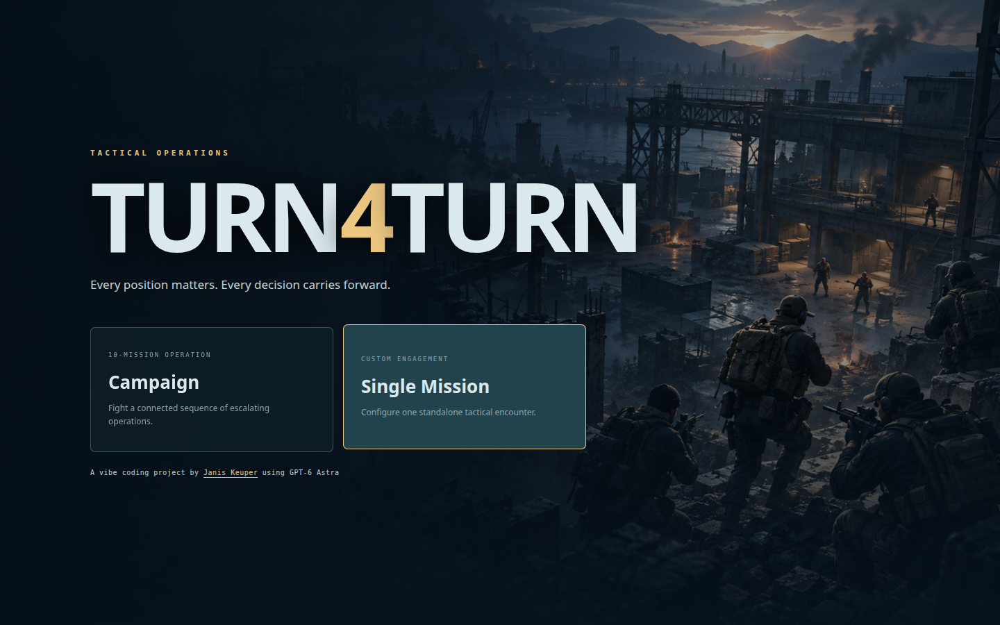
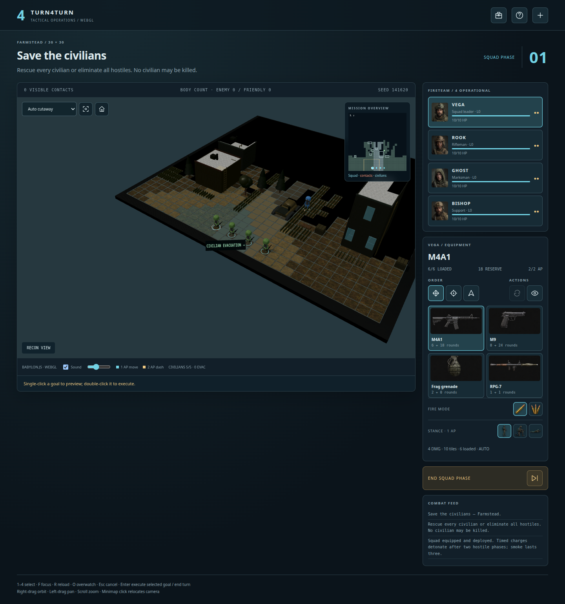

# Turn4Turn

Turn-based tactical operations in the browser. Command a four-person fireteam,
manage limited action points and equipment, clear multi-storey environments, and
keep civilians alive. Python runs the authoritative simulation while Babylon.js
renders the battlefield locally with WebGPU and an automatic WebGL 2 fallback.

> A vibe coding project by [Janis Keuper](https://github.com/keuperj), built with GPT-6 Astra.



## Features

- **Two ways to play:** a ten-mission campaign with fixed briefings and a fully
  configurable single-mission mode.
- **Server-authoritative tactics:** movement, visibility, targeting, damage,
  destructible structures, enemy turns, and objectives are validated in Python.
- **Isolated multiplayer sessions:** every consenting browser receives its own
  game instance; per-player locks keep concurrent requests safe.
- **Procedural battlefields:** urban districts, factories, stations, airports,
  streets, woods, and farms across three map sizes.
- **Enterable buildings:** connected rooms, multiple floors, doors, windows,
  stairs, ladders, roofs, cutaway views, and indoor defenders.
- **Four mission types:** eliminate hostiles, rescue civilians, capture a flag,
  or defend a position.
- **Tactical positioning:** standing, kneeling, and prone stances; directional
  cover; high ground; peeking; overwatch; smoke; and last-seen contact markers.
- **Flexible loadouts:** rifles, machine guns, pistols, sniper rifles, shotgun,
  RPG, grenades, demolition charges, and medical support. Preferred loadouts can
  be saved as a browser cookie.
- **Destructible environments:** weapons damage vehicles and structures;
  collapsed buildings become rubble and can kill occupants.
- **Fog of war:** the browser receives only detected enemies, remembered
  casualties, and previously observed positions—never hidden live state.
- **Local audiovisual assets:** rigged glTF soldiers, generated equipment and
  stance art, spatial effects, weapon sounds, interactions, and themed ambience.
- **No runtime CDN:** the engine, models, textures, and sounds are bundled.



## Requirements

- Python 3.10 or newer
- A modern browser with WebGPU or WebGL 2 enabled
- No Python packages for normal play

The landing page opens without downloading the game engine or mission assets.
The first mission loads the renderer, models, textures and sounds behind a progress
panel with rotating equipment artwork, descriptions and authoritative game stats.
Preview artwork is fetched and decoded before larger mission resources, so the
field guide only displays ready images. Audio and renderer loading overlap.
Later missions reuse loaded assets. The cards respect reduced-motion preferences.
Static resources support gzip and ETag revalidation; unchanged downloads are reused
across page reloads, while edited files receive fresh responses. Player API data
remains uncached. Gzip reduces the bundled engine/model payload from about 27 MiB
to 5.4 MiB; actual loading time also depends on the connection and rendering device.

The landing page runs a bounded capability check. Babylon.js selects WebGPU only
after adapter, device, compute, and canvas stages pass; WebGL 2 remains the
default when the check is unavailable, fails, or times out. WebGPU initialization
failures also fall back to WebGL 2.

## Setup

Clone the repository and start the server:

```sh
git clone https://github.com/keuperj/Turn4Turn.git
cd Turn4Turn
python3 server.py
```

Open [http://localhost:8000](http://localhost:8000). On the first visit, choose a
user name and consent to the cookies required for player identification and
progress. Stop the server with `Ctrl+C`.

To use a different port:

```sh
python3 server.py --port 8002
```

Then open [http://localhost:8002](http://localhost:8002).

For development and CI, create the complete Conda environment with:

```sh
conda env create --file environment.yml
conda activate turn4turn
python -m playwright install chromium
```

The GitHub Actions Conda workflow uses the same `environment.yml` when running
lint and tests. The separate Playwright install command downloads Chromium for
local browser and WebGPU diagnostics; it is not needed for the Python unit
tests.

To make the game reachable from another computer, bind the server to the
machine's network IP:

```sh
python3 server.py --host 192.168.1.50
```

Alternatively, listen on all network interfaces with `--host 0.0.0.0`. Remote
players should open the server machine's actual IP address (for example,
`http://192.168.1.50:8000`), not `0.0.0.0`.

To enable HTTPS, pass `--https` and preferably bind to the exact name or IP that
players will open:

```sh
python3 server.py --host 192.168.1.50 --https
```

The server uses the `openssl` command to create a one-year self-signed
certificate in `.certs/`, then reuses it on later starts. Open
`https://192.168.1.50:8000` and accept the browser's warning for this local
certificate. In Firefox, choose **Advanced…** and **Accept the Risk and
Continue**. For repeated use, import the generated `.crt` file into the client
system or browser trust store. A public server should use a certificate from a
trusted certificate authority instead.

## Server configuration

Command-line options:

| Option | Default | Description |
| --- | ---: | --- |
| `--host ADDRESS` | `127.0.0.1` | IP address or host name to bind to. Use `0.0.0.0` for all interfaces. |
| `--port PORT` | `8000` | HTTP port. |
| `--max-players COUNT` | `10` | Maximum number of active, isolated player sessions. Must be at least 1. |
| `--https` | off | Generate or reuse a local self-signed certificate and serve HTTPS. |

Example:

```sh
python3 server.py --host 0.0.0.0 --port 8080 --max-players 20 --https
```

Additional constants are defined near the top of `server.py`:

| Variable | Default | Purpose |
| --- | ---: | --- |
| `MAX_PLAYERS` | `10` | Default active-player limit used when the CLI option is omitted. |
| `SESSION_TIMEOUT` | `1800` seconds | Idle time after which a session releases its player slot. |
| `COOKIE_AGE` | `365` days | Lifetime of persistent player cookies. |

When the active-player limit is reached, a new visitor is not assigned a game
and sees a **Try again later** screen. An existing active player can reconnect
with the same user-ID cookie without consuming another slot.

The in-memory game sessions do not survive a Python server restart. Browser
cookies for identity, campaign progress, and preferred loadout remain available.

## Browser storage and privacy

Turn4Turn asks for consent before creating its player cookies.

| Cookie | Contents |
| --- | --- |
| `turn4turn_user` | Random player ID; marked `HttpOnly` and `SameSite=Lax`. |
| `turn4turn_name` | The chosen display name. |
| `turn4turn_campaign` | Current campaign index and active mission seed. |
| `turn4turn_loadout` | Optional default equipment selection. |

Cookies are scoped to the game path and are not sent to third-party services.
The loadout cookie is created only when **Use this equipment selection as my
default loadout** is enabled during mission preparation. Clearing site data
resets the browser identity and saved preferences.

## Mission configuration

Single Mission mode exposes the following settings before deployment. Campaign
missions provide these values from their briefing and keep them locked.

### Mission type

| Mission | Objective |
| --- | --- |
| Eliminate all enemies | Neutralize every hostile fighter. |
| Save the civilians | Evacuate every civilian or eliminate all hostiles without civilian losses. |
| Capture the enemy flag | Reach the hostile flag within 30 rounds. |
| Defend the flag | Hold the squad flag for 30 rounds or eliminate all hostiles. |

### Theater and scale

- **Theaters:** Random, Urban District, Factory, Train Station, Airport, Streets,
  Woods, and Farm.
- **Map sizes:** Compact `24×24`, Standard `30×30`, and Large `40×40`.
- **Time:** Day or Night.

Larger maps generate more scenery, structures, walkable area, and hostiles.

Urban maps use compact downtown blocks with 3–6-storey buildings, shops and cafés
with outdoor seating. Asphalt streets, crosswalks, sidewalks and paved pedestrian
lanes surround one seeded pocket park with trees, shrubs and a bench. Parked cars,
traffic signals, signs, street lamps and bins have collision footprints; generation
keeps entrances and pedestrian routes connected. Streets continue into a matching
background street grid and skyline. Cutaway controls include all six upper levels.

Street crossing is a suburban four-lane junction (two lanes in each direction on
both roads), with lane markings, zebra crossings, traffic signals and stopped cars.
Detached one- and two-storey homes sit behind sidewalks and planted front gardens,
with clear paths to their doors. The roads, sidewalks and houses continue into the
static background. Road paint and distant traffic are batched; fog updates retain
the scenery and vehicle instances.

Woodlands uses dense mixed forest with seeded grassy clearings and scattered
single-storey timber huts. Narrow footpaths connect every entrance to deployment
and continue into the surrounding forest. Vegetation preserves walkable routes;
background plants are decorative and do not affect movement or targeting.

Trainstation centers on two parallel railway tracks with independently placed trains.
A large station has paired double doors from the street and covered platform,
opening into a waiting hall with seating, a ticket counter, a table and bins.
Both door leaves open together for one action point. Framed windows and
forecourt trees complete the buildings; the opposite platform has benches, bins and lamps. Clear crossings
connect both sides, with smaller city buildings and streets where space permits.
The rails continue through the city background.

Farmstead has a farmhouse, barns and a machine shed connected by clear dirt paths.
Locally bundled tractor, front-loader, cow, sheep and pig models populate the yard.
Mixed trees, shrubs and pasture grass fill the playable grounds, with hedgerows and
shelter belts continuing into the surrounding fields. Equipment and vegetation
preserve access to every entrance; livestock are static scenery.

Airport centers on a clear runway and apron with locally bundled light aircraft,
business jet, tug, fuel bowser, power cart and windsock models. A larger terminal
has a furnished waiting area and check-in counter, alongside two hangars and a
three-storey control tower. Runway markings continue seamlessly into the flat
grassland background; an approach road leads directly to the terminal entrance.
Compact maps have one parked aircraft; standard and large maps have two.

Factory is an indoor production hall with three playable levels: the main floor,
a connected mezzanine, and an upper assembly gallery. Only the north and west
outer walls are shown; the south and east sides stay open, against a plain background.
Imported CNC machines, lathes, mills, compressors, storage racks, welding robots,
conveyors and a forklift furnish the floors. Stairs connect the levels; floor controls
reveal lower work areas. Equipment has collision, visibility and damage on its own floor.

### Difficulty

| Difficulty | Squad AP | Hostile AP |
| --- | ---: | ---: |
| Easy | 3 | 1 |
| Medium | 2 | 2 |
| Hard | 2 | 3 |

### Equipment

Each fighter receives four distinct equipment slots. Any weapon or support item
can occupy any slot, and carried equipment can be switched during the mission.
The chosen loadout becomes fixed after deployment.

| Equipment | Tactical role |
| --- | --- |
| M4A1, HK416, M249 | Single or three-round automatic fire |
| M110 | Accurate semiautomatic marksman rifle |
| M24 sniper | Long-range, high-damage shot requiring 2 AP |
| Shotgun | High damage at short range |
| M9 | Sidearm; firing costs 1 AP |
| RPG-7 | Direct-fire explosive and heavy structural damage |
| Frag grenade | Ballistic throw over obstacles; radius damage to either team |
| Smoke grenade | Ballistic throw; blocks sight for three hostile phases |
| Demolition charge | Short-range placement, delayed four-tile blast |
| Medikit | Two adjacent treatments restoring up to 6 HP each |

Grenades may arc to an explored surface without direct line of sight. Walls and
closed doors still shield units from the resulting blast. Rockets require a
clear line of fire, and demolition charges must be planted within 1.5 tiles.

## Controls

1. Select a fighter and choose movement, attack, or facing mode.
2. Single-click a point to preview the authoritative path or attack solution.
3. Double-click the same point to execute it.

| Input | Action |
| --- | --- |
| `1`–`4` | Select a squad member |
| `F` | Focus the selected fighter |
| `R` | Reload |
| `O` | Enter overwatch |
| `Escape` | Cancel the current preview |
| `Enter` | Execute a pending order or end the squad phase |
| Right-drag | Orbit the camera |
| Left-drag | Pan the camera |
| Mouse wheel | Zoom |
| Minimap click | Reposition the camera without issuing an order |

Opening doors and windows costs 1 AP. Changing stance costs 1 AP. Peeking costs
1 AP and briefly exposes the fighter to reaction fire. The interface reports AP
cost, hit chance, target health, blast victims, and friendly-fire risk before an
order is executed.

## Architecture

| Path | Responsibility |
| --- | --- |
| `server.py` | Threaded HTTP server, cookies, capacity, and per-player sessions |
| `game.py` | Authoritative turns, AI, missions, movement, and damage |
| `targeting.py` | Attack previews and coordinate targeting |
| `visibility.py` | Fog of war and public-state filtering |
| `fieldcraft.py` | Facing, peeking, healing, and nearby interactions |
| `arsenal.py` | Loadouts, ammunition, explosives, and destruction |
| `world.py` | Seeded map and building generation |
| `static/app.js` | Browser state, session consent, controls, and preparation UI |
| `static/scene.js` | Babylon.js battlefield and effects |
| `static/characters.js` | glTF character models, animation, and poses |
| `static/environment.js` | Structures, scenery, and visual damage |
| `static/minimap.js` | Fog-aware tactical overview |
| `static/audio.js` | Local effects, ambience, and spatial mixing |

The Python state is authoritative. The renderer handles presentation and input,
but it cannot decide whether an action is legal or alter hidden simulation state.

Rendering updates retain unchanged buildings, props, ladders and character rigs.
Visibility updates rebuild only the two fog meshes; discovery, damage and cutaways
invalidate the affected scenery layers. Moving or turning a character updates its
transform without cloning its skeleton and materials. Scene cleanup also releases
character-owned texture clones while preserving shared source textures.

Maintained Python modules, classes, and functions use docstrings. Maintained
browser modules and named APIs use JSDoc. Bundled third-party libraries under
`static/vendor/` and `static/comparison/vendor/` retain their upstream comments.

## Engine comparison

Start the game and visit [http://localhost:8000/comparison/](http://localhost:8000/comparison/)
to view the isolated Babylon.js, PlayCanvas, and Three.js renderer study. It uses
shared assets and camera paths but is separate from the playable simulation. See
the [comparison notes](static/comparison/README.md).

## Testing

Run the simulation and server tests:

```sh
python3 -m unittest discover -s tests -p 'test_*.py'
```

Optional browser checks require Playwright and Chromium:

```sh
python3 tests/browser_smoke.py --browser /snap/bin/chromium
python3 tests/browser_webgpu.py
python3 tests/browser_campaign.py
python3 tests/browser_loading.py
python3 tests/browser_picking.py
python3 tests/browser_picking.py --dpr 1
python3 tests/browser_incremental.py
python3 tests/browser_incremental.py --webgpu
python3 tests/browser_background.py
python3 tests/browser_urban.py
python3 tests/browser_streets.py
python3 tests/browser_interiors.py
python3 tests/browser_babylon.py
python3 tests/browser_audio.py
```

### Browser WebGPU readiness test

With the server running, open [http://localhost:8000/gpu-test](http://localhost:8000/gpu-test).
The page tests the visiting browser's GPU—not the server's—and reports:

- secure-context and WebGPU API availability;
- hardware or fallback adapter identity;
- GPU features and capacity limits;
- device creation, WGSL compute, and canvas rendering; and
- browser-specific recovery hints when a stage fails.

Remote visitors must use HTTPS (start the server with `--https`). A network URL such as
`http://192.168.1.50:8000/gpu-test` is not a secure context and browsers will
not expose WebGPU there. The test does not send detected hardware information
back to the server.

Firefox enables WebGPU by default on supported Windows releases and Apple
silicon Macs. On Linux and Intel Macs, use the current Firefox Nightly build.
For experimental Firefox testing, open `about:config`, set
`dom.webgpu.enabled` to `true`, restart Firefox, and inspect the Graphics
section of `about:support` if the adapter is still unavailable.

To validate WebGPU independently of the game, check that Chromium can acquire a
GPU adapter and complete both compute and canvas-rendering work:

```sh
python3 tools/check_webgpu.py
# Or select a browser explicitly:
python3 tools/check_webgpu.py --browser /snap/bin/chromium
```

The check exits with status 0 when WebGPU works and status 1 when the API,
adapter, device, compute shader, or canvas render is unavailable. Use `--json`
for machine-readable output and `--headed` to diagnose differences between
headless and interactive browser sessions. On Linux, the checker starts
Chromium's full headless implementation with its Vulkan WebGPU backend enabled.

The suite covers game rules, all themes and map sizes, fog-of-war privacy,
interiors, loadout validation, campaign persistence, session isolation, player
capacity, WebGPU and WebGL rendering, animation, and audio fallback behavior.

## Assets and credits

- Babylon.js is bundled under the [Apache 2.0 license](static/vendor/BABYLON-LICENSE.txt).
- Character source and conversion notes are documented in
  [static/assets/models/README.md](static/assets/models/README.md).
- Equipment, landing, campaign, ammunition, and stance images were created for
  the project with OpenAI image generation. Prompt records are stored alongside
  the assets where available.
- Local action and ambience samples were generated with ElevenLabs. See the
  [sound asset guide](static/sounds/README.md).

There is no music and the game does not contact image or audio generation
services during play.

## License

Turn4Turn is licensed under the [GNU General Public License version 2](LICENSE)
(`GPL-2.0-only`).
